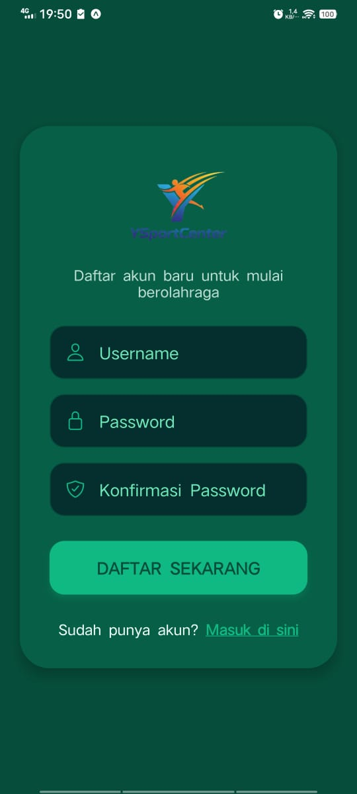
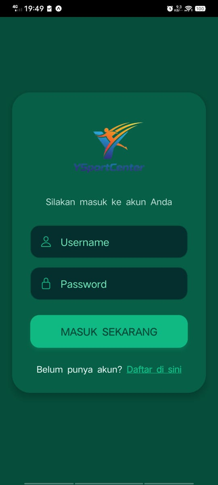
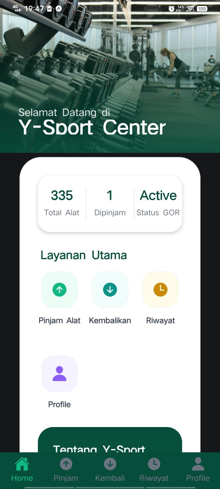
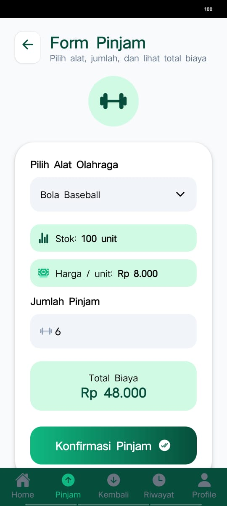
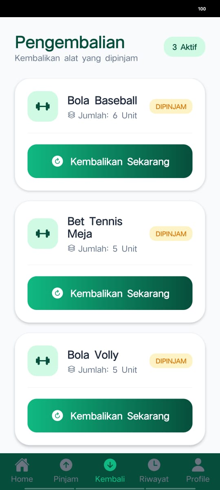
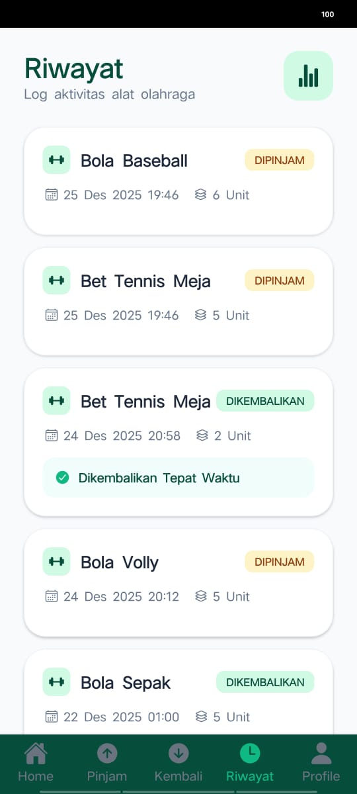
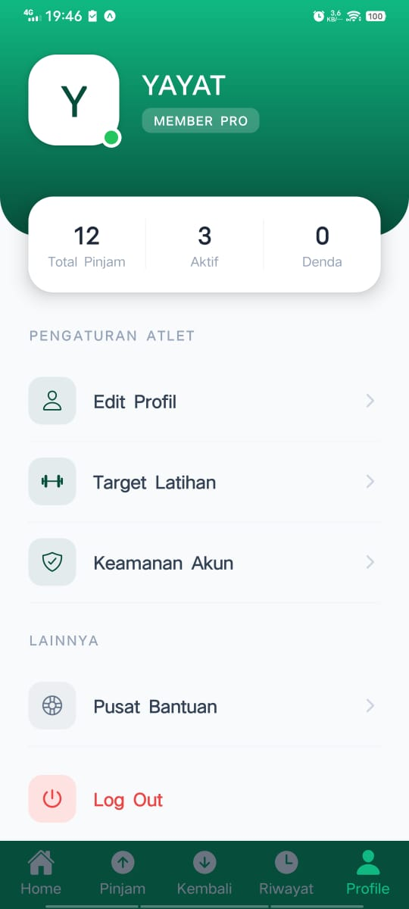

## 📌 Deskripsi Aplikasi
**Y-Sport Center** adalah aplikasi peminjaman alat olahraga yang dirancang untuk memudahkan proses pengelolaan, peminjaman, dan pengembalian alat olahraga secara digital.  
Aplikasi ini memiliki dua peran pengguna, yaitu **Admin** dan **User**, dengan hak akses dan fitur yang berbeda.
Project ini dibangun menggunakan **Expo Router (file-based routing)** dan **TypeScript**.

Aplikasi ini cocok digunakan untuk:
- Pusat kebugaran
- Komunitas olahraga
- Club olahraga

---

## 📱 Screenshot Aplikasi

Tampilan antarmuka Sistem Penjualan Sparepart Motor:

| Screenshot | Screenshot |
|-----------|------------|
 |  
|  | 
|  | 
| 

## 🎯 Tujuan Aplikasi
- Mengelola data alat olahraga secara terpusat
- Mempermudah proses peminjaman dan pengembalian alat
- Menghindari kehilangan alat
- Menyediakan riwayat peminjaman yang jelas dan terstruktur

---

## 🚀 Cara Menjalankan Aplikasi

### 1️⃣ Persiapan Awal
Pastikan sudah terinstall:
- **Node.js** (versi LTS)
- **NPM**
- **Expo CLI**
- **Aplikasi Expo Go** (Android / iOS)

## Cara Clone Project ini
git clone https://github.com/username/y-sport-center.git
cd y-sport-center

1. Install dependencies

   ```bash
   npm install
   ```

2. Start the app

   ```bash
   npx expo start
   ```

## 👥 Hak Akses Pengguna

### 1️⃣ Admin
Admin bertugas mengelola seluruh sistem dalam aplikasi.

**Fitur Admin:**
- Home / Dashboard
- Manajemen alat olahraga
  - Tambah alat
  - Edit alat
  - Hapus alat
- Manajemen peminjam
- Data alat yang sudah dikembalikan
- Riwayat peminjaman
- Profil admin

---

### 2️⃣ User
User adalah peminjam alat olahraga.

**Fitur User:**
- Home
- Peminjaman alat olahraga
- Pengembalian alat
- Riwayat peminjaman pribadi
- Profil user

---

## 🛠️ Teknologi yang Digunakan
- **Frontend**: Expo (React Native)
- **Backend**: (Opsional / dapat dikembangkan)
- **Database**: PostgreSQL
- **Platform**: Android / iOS
- **Bahasa Pemrograman**: JavaScript / TypeScript

---

## 🗂️ Struktur Menu Aplikasi
YAYATSPORT/
│
├── .expo/                    # Konfigurasi internal Expo
├── .vscode/                  # Konfigurasi VS Code
│
├── app/                      # Routing utama (Expo Router)
│   ├── (tabs)/               # Tab navigation
│   ├── layout.tsx            # Layout utama aplikasi
│   ├── login.tsx             # Halaman login
│   ├── modal.tsx             # Modal screen
│   └── register.tsx          # Halaman registrasi
│
├── assets/                   # Asset statis (icon, gambar, font)
│
├── components/               # Reusable UI components
│
├── constants/                # Konstanta global (warna, ukuran, dll)
│
├── hooks/                    # Custom React Hooks
│
├── node_modules/             # Dependency NPM
│
├── scripts/                  # Script tambahan (build / helper)
│
├── src/                      # Core aplikasi
│   │
│   ├── context/              # Context API
│   │   └── AuthContext.tsx   # Context autentikasi
│   │
│   ├── database/             # Konfigurasi database
│   │   └── db.ts             # Koneksi PostgreSQL
│   │
│   ├── models/               # Model data
│   │   └── Alat.ts           # Model alat olahraga
│   │
│   ├── services/             # Logic komunikasi data
│   │   ├── alatService.ts        # Service alat olahraga
│   │   ├── authService.ts        # Service autentikasi
│   │   └── peminjamanService.ts # Service peminjaman
│   │
│   └── types/                # TypeScript types & interfaces
│
├── .gitignore                # File yang diabaikan Git
├── app.json                  # Konfigurasi aplikasi Expo
├── eslint.config.js           # Konfigurasi ESLint
├── expo-env.d.ts              # Type Expo
├── package.json               # Informasi project & dependency
├── package-lock.json          # Lock dependency
├── README.md                  # Dokumentasi aplikasi
└── tsconfig.json              # Konfigurasi TypeScript

### 🔐 Admin


---

## 🧩 Fitur Utama
- Autentikasi Login & Register
- Manajemen data alat olahraga
- Sistem peminjaman dan pengembalian
- Riwayat peminjaman (tracking)
- Profil pengguna
- Role-based access (Admin & User)

---

## 🗃️ Gambaran Database (Sederhana)
Tabel utama yang digunakan:
- users
- alat_olahraga
- peminjaman
- pengembalian
- riwayat

---
